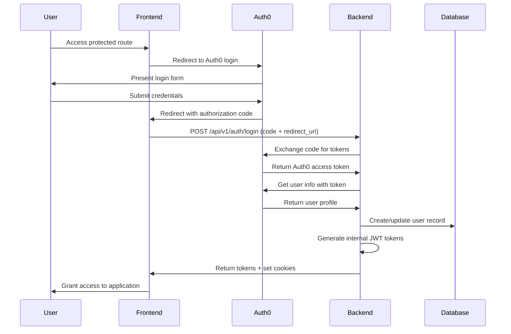
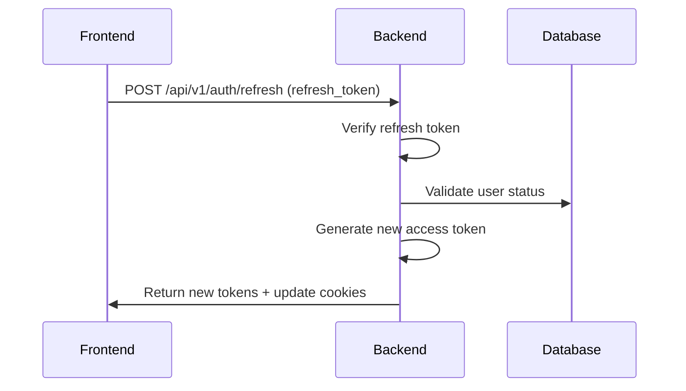

# MarketEdge Authentication Architecture

## Overview

MarketEdge implements a sophisticated dual authentication strategy combining **Auth0 OAuth2** for identity management with **internal JWT tokens** for application-specific context and multi-tenant isolation. This architecture supports the £925K Zebra Associates opportunity while maintaining enterprise-grade security and scalability.

## Table of Contents

1. [Architecture Overview](#architecture-overview)
2. [Authentication Flow](#authentication-flow)
3. [Token Management](#token-management)
4. [Application Access Control](#application-access-control)
5. [Multi-Tenant Authentication](#multi-tenant-authentication)
6. [Security Implementation](#security-implementation)
7. [Frontend Integration](#frontend-integration)
8. [Troubleshooting Guide](#troubleshooting-guide)
9. [Technical Debt & Improvements](#technical-debt--improvements)

## Architecture Overview

### Dual Authentication Strategy

```
┌─────────────────┐    OAuth2/OIDC    ┌─────────────────┐
│     Auth0       │ ←───────────────→ │    Frontend     │
│  Identity Provider │                │   (Next.js)     │
└─────────────────┘                  └─────────────────┘
         │                                    │
         │ User Info / Token Exchange         │ API Calls
         │                                    │
         ▼                                    ▼
┌─────────────────────────────────────────────────────────┐
│              MarketEdge Backend                         │
│  ┌─────────────────┐    ┌─────────────────────────────┐ │
│  │   Auth0 Client  │    │    Internal JWT System      │ │
│  │   Integration   │    │   - Multi-tenant context    │ │
│  │                 │    │   - Role-based permissions  │ │
│  └─────────────────┘    │   - Application access      │ │
│                         └─────────────────────────────┘ │
└─────────────────────────────────────────────────────────┘
```

### Key Components

- **Auth0**: External identity provider for OAuth2/OIDC authentication
- **Internal JWT**: Application-specific tokens with tenant context and permissions
- **Multi-tenant RLS**: PostgreSQL Row Level Security for data isolation
- **Application Access**: Granular permissions for Market Edge, Causal Edge, Value Edge

## Authentication Flow

### 1. Initial Authentication Flow



### 2. Token Refresh Flow



### 3. Dual Token Verification

The backend supports both Auth0 tokens and internal JWTs through a fallback mechanism:

```python
# From app/auth/dependencies.py
async def get_current_user():
    # Try internal JWT first
    payload = verify_token(credentials.credentials, expected_type="access")

    # CRITICAL FIX: Fallback to Auth0 token verification
    if payload is None:
        payload = await verify_auth0_token(credentials.credentials)
        if payload is None:
            raise credentials_exception
```

## Token Management

### 5 Token Retrieval Strategies

The platform implements multiple token retrieval strategies to handle different environments and authentication flows:

#### 1. Production Cookie Strategy
```typescript
// Production: httpOnly cookies for security
const token = Cookies.get('access_token')
```

#### 2. Development localStorage Strategy
```typescript
// Development: localStorage for debugging
const token = localStorage.getItem('access_token')
```

#### 3. Environment-Aware Strategy
```typescript
const token = process.env.NODE_ENV === 'production'
  ? Cookies.get('access_token')
  : localStorage.getItem('access_token')
```

#### 4. Authorization Header Strategy
```typescript
// Direct API calls
headers: {
  'Authorization': `Bearer ${token}`
}
```

#### 5. Fallback Strategy
```typescript
// Multiple fallback attempts
const token = getTokenFromCookies() ||
              getTokenFromLocalStorage() ||
              getTokenFromSessionStorage()
```

### Token Storage Mechanisms

#### Cookie Configuration
```python
# US-AUTH-1: Differentiated cookie settings
base_cookie_settings = {
    "secure": True,      # HTTPS only in production
    "samesite": "lax",   # CSRF protection
    "domain": None,      # Current domain only
    "path": "/"          # All paths
}

# Access token: Frontend accessible (httpOnly: False)
access_cookie_settings = base_cookie_settings.copy()
access_cookie_settings["httponly"] = False

# Refresh token: Secure only (httpOnly: True)
refresh_cookie_settings = base_cookie_settings.copy()
refresh_cookie_settings["httponly"] = True
```

#### Cookie Types
1. **access_token**: Frontend-accessible (httpOnly: false), 30min expiry
2. **refresh_token**: Secure-only (httpOnly: true), 7 days expiry
3. **session_security**: Secure verification cookie
4. **csrf_token**: CSRF protection token

### JWT Token Structure

#### Access Token Claims
```json
{
  "sub": "user-uuid",
  "email": "user@example.com",
  "tenant_id": "org-uuid",
  "role": "admin",
  "user_role": "admin",
  "industry": "cinema",
  "permissions": ["read:users", "admin:market_edge"],
  "type": "access",
  "iat": 1640995200,
  "exp": 1640998800,
  "jti": "unique-token-id",
  "iss": "market-edge-platform",
  "aud": "market-edge-api"
}
```

#### Refresh Token Claims
```json
{
  "sub": "user-uuid",
  "tenant_id": "org-uuid",
  "type": "refresh",
  "family": "token-family-id",
  "iat": 1640995200,
  "exp": 1641600000,
  "jti": "unique-token-id"
}
```

## Application Access Control

### Data Flow Architecture

```
┌─────────────────┐    Database     ┌─────────────────────────┐
│  Backend API    │ ←──────────────→ │ user_application_access │
│                 │                 │ ┌─────────────────────┐ │
│ Format:         │                 │ │ application (enum)  │ │
│ ApplicationType │                 │ │ has_access (bool)   │ │
│ (uppercase)     │                 │ │ user_id (UUID)      │ │
└─────────────────┘                 │ └─────────────────────┘ │
         │                          └─────────────────────────┘
         │ API Response
         │ (lowercase format)
         ▼
┌─────────────────┐    Type Safety   ┌─────────────────────────┐
│    Frontend     │ ←──────────────→ │   Application Utils     │
│                 │                 │ ┌─────────────────────┐ │
│ Format:         │                 │ │ hasApplicationAccess│ │
│ ApplicationName │                 │ │ getAccessibleApps   │ │
│ (uppercase)     │                 │ │ getPrimaryApp       │ │
└─────────────────┘                 │ └─────────────────────┘ │
                                    └─────────────────────────┘
```

### Format Conversion System

#### Backend to Frontend Mapping
```python
# Backend enum (database storage)
class ApplicationType(enum.Enum):
    MARKET_EDGE = "market_edge"    # Stored as lowercase
    CAUSAL_EDGE = "causal_edge"
    VALUE_EDGE = "value_edge"

# API response format (lowercase)
{
  "application": "market_edge",
  "has_access": true
}
```

#### Frontend Type Handling
```typescript
// Frontend types (uppercase for consistency)
type ApplicationName = 'MARKET_EDGE' | 'CAUSAL_EDGE' | 'VALUE_EDGE'
type ApplicationNameLowercase = 'market_edge' | 'causal_edge' | 'value_edge'

// Conversion utilities
function toLowercase(app: ApplicationName): ApplicationNameLowercase {
  const mapping = {
    'MARKET_EDGE': 'market_edge',
    'CAUSAL_EDGE': 'causal_edge',
    'VALUE_EDGE': 'value_edge'
  }
  return mapping[app]
}
```

### Access Control Implementation

#### Backend Application Access Dependency
```python
def require_application_access(application_name: str):
    async def _require_application_access(
        current_user: User = Depends(get_current_active_user),
        db: AsyncSession = Depends(get_async_db)
    ) -> User:
        # Check application access record
        stmt = select(UserApplicationAccess).where(
            UserApplicationAccess.user_id == current_user.id,
            UserApplicationAccess.application == ApplicationType(application_name.upper()),
            UserApplicationAccess.has_access == True
        )
        result = await db.execute(stmt)
        access_record = result.scalars().first()

        if not access_record:
            raise HTTPException(
                status_code=403,
                detail=f"Access to {application_name} application is required"
            )
        return current_user
    return _require_application_access
```

#### Frontend Access Checking
```typescript
// Check if user has access to specific application
export function hasApplicationAccess(
  applicationAccess: ApplicationAccess[] | { [key: string]: boolean },
  application: ApplicationName | ApplicationNameLowercase
): boolean {
  if (Array.isArray(applicationAccess)) {
    // New format: ApplicationAccess[]
    const accessRecord = applicationAccess.find(access =>
      access.application === application ||
      access.application === toLowercase(application as ApplicationName)
    )
    return accessRecord?.has_access || false
  }

  // Legacy format: { [key: string]: boolean }
  return applicationAccess[application] || false
}
```

## Multi-Tenant Authentication

### Tenant Context Extraction

```python
def extract_tenant_context_from_token(payload: Dict[str, Any]) -> Dict[str, Any]:
    return {
        "tenant_id": payload.get("tenant_id"),
        "user_role": payload.get("user_role") or payload.get("role"),
        "user_id": payload.get("sub"),
        "industry": payload.get("industry"),
        "permissions": payload.get("permissions", [])
    }
```

### Auth0 Organization Mapping

Special handling for Zebra Associates (£925K opportunity):

```python
# Auth0 organization ID mapping
auth0_org_mapping = {
    "zebra-associates-org-id": "835d4f24-cff2-43e8-a470-93216a3d99a3",
    "zebra-associates": "835d4f24-cff2-43e8-a470-93216a3d99a3",
    "zebra": "835d4f24-cff2-43e8-a470-93216a3d99a3",
}
```

### Tenant Isolation Patterns

#### Database Row Level Security (RLS)
```sql
-- Example RLS policy
CREATE POLICY tenant_isolation ON users
FOR ALL TO authenticated_user
USING (organisation_id = current_setting('app.current_tenant_id')::uuid);
```

#### Request State Management
```python
# Store tenant context in request state
request.state.tenant_context = extract_tenant_context_from_token(payload)

# Access in endpoints
def get_tenant_context(request: Request) -> Optional[Dict[str, Any]]:
    return getattr(request.state, 'tenant_context', None)
```

## Security Implementation

### CORS Configuration

**CRITICAL**: CORSMiddleware must be added FIRST in the middleware stack:

```python
# CRITICAL FIX: CORSMiddleware FIRST for error responses
app.add_middleware(CORSMiddleware)          # FIRST (runs last on response)
app.add_middleware(TrustedHostMiddleware)
app.add_middleware(ErrorHandlerMiddleware)
app.add_middleware(LoggingMiddleware)
```

#### CORS Origins for Zebra Associates
```python
critical_origins = [
    "https://app.zebra.associates",
    "https://marketedge-frontend.onrender.com",
    "https://frontend-36gas2bky-zebraassociates-projects.vercel.app",
    "https://zebraassociates-projects.vercel.app",
    "https://marketedge.vercel.app",
    "http://localhost:3000",  # Development
]
```

### Authentication Error Handling

#### 401 vs 403 Distinction
```python
# HTTPBearer auto_error=False for manual handling
security = HTTPBearer(auto_error=False)

if not credentials:
    raise HTTPException(
        status_code=401,  # Missing authentication
        detail="Authentication required"
    )

if not access_record:
    raise HTTPException(
        status_code=403,  # Insufficient permissions
        detail="Access to application is required"
    )
```

### Input Validation & Sanitization

```python
# Enhanced validation with sanitization
def sanitize_string_input(value: str, max_length: int = 255) -> str:
    if not value:
        return ""
    # Remove potential injection patterns
    sanitized = re.sub(r'[<>"\';]', '', value.strip())
    return sanitized[:max_length]

# Comprehensive parameter validation
class AuthParameterValidator:
    def __init__(self, code: str, redirect_uri: str, state: Optional[str] = None):
        self.code = sanitize_string_input(code, max_length=500)
        self.redirect_uri = sanitize_string_input(redirect_uri, max_length=200)
        self.state = sanitize_string_input(state, max_length=100) if state else None
```

## Frontend Integration

### Authentication Context

```typescript
// Authentication state management
interface AuthState {
  user: User | null
  isAuthenticated: boolean
  isLoading: boolean
  applicationAccess: ApplicationAccess[]
}

// Token retrieval with environment awareness
const getToken = (): string | null => {
  if (typeof window === 'undefined') return null

  return process.env.NODE_ENV === 'production'
    ? Cookies.get('access_token')
    : localStorage.getItem('access_token')
}
```

### API Client Configuration

```typescript
// Authenticated API calls
const apiClient = axios.create({
  baseURL: process.env.NEXT_PUBLIC_API_URL,
  withCredentials: true,  // Include cookies
})

// Token interceptor
apiClient.interceptors.request.use((config) => {
  const token = getToken()
  if (token) {
    config.headers.Authorization = `Bearer ${token}`
  }
  return config
})

// Response interceptor for token refresh
apiClient.interceptors.response.use(
  (response) => response,
  async (error) => {
    if (error.response?.status === 401) {
      // Attempt token refresh
      await refreshToken()
      return apiClient.request(error.config)
    }
    return Promise.reject(error)
  }
)
```

### Application Access Routes

```typescript
// Route protection with application access
const useApplicationAccess = (requiredApp: ApplicationName) => {
  const { user, applicationAccess } = useAuth()

  return useMemo(() => {
    return hasApplicationAccess(applicationAccess, requiredApp)
  }, [applicationAccess, requiredApp])
}

// Route component
export default function CausalEdgePage() {
  const hasAccess = useApplicationAccess('CAUSAL_EDGE')

  if (!hasAccess) {
    return <AccessDenied application="Causal Edge" />
  }

  return <CausalEdgeDashboard />
}
```

## Troubleshooting Guide

### Common Authentication Issues

#### 1. CORS Errors Masking 500 Errors

**Problem**: Browser shows "No 'Access-Control-Allow-Origin'" instead of actual server errors

**Solution**: Ensure CORSMiddleware is added FIRST in middleware stack
```python
# ❌ WRONG - CORS added after other middleware
app.add_middleware(ErrorHandlerMiddleware)
app.add_middleware(CORSMiddleware)

# ✅ CORRECT - CORS added first
app.add_middleware(CORSMiddleware)
app.add_middleware(ErrorHandlerMiddleware)
```

#### 2. Token Verification Failures

**Problem**: "Could not validate credentials" errors

**Debugging Steps**:
```python
# Check token format
payload = verify_token(token, expected_type="access")
if not payload:
    # Try Auth0 token verification
    payload = await verify_auth0_token(token)
```

**Common Causes**:
- Token expired (check `exp` claim)
- Wrong token type (access vs refresh)
- Invalid JWT signature
- Missing required claims

#### 3. Application Access Denied

**Problem**: User gets 403 errors for applications they should access

**Debugging Steps**:
```sql
-- Check user application access records
SELECT ua.*, u.email, u.role
FROM user_application_access ua
JOIN users u ON ua.user_id = u.id
WHERE u.email = 'user@example.com';
```

**Solutions**:
- Grant application access via admin panel
- Check enum value case sensitivity (uppercase vs lowercase)
- Verify user role permissions

#### 4. Lazy Loading Errors in Async Context

**Problem**: "Object is not bound to a Session" errors

**Solution**: Use comprehensive eager loading
```python
# ✅ CORRECT - Eager load all relationships
result = await db.execute(
    select(User).options(
        selectinload(User.organisation),
        selectinload(User.application_access),
        selectinload(User.hierarchy_assignments),
        selectinload(User.permission_overrides)
    ).filter(User.id == user_id)
)
```

#### 5. Cookie Not Set Issues

**Problem**: Frontend not receiving authentication cookies

**Debugging**:
- Check `withCredentials: true` in API calls
- Verify CORS `allow_credentials: true`
- Ensure domain matches between frontend/backend
- Check SameSite policy compatibility

### Environment-Specific Debugging

#### Development Environment
```bash
# Check localStorage tokens
localStorage.getItem('access_token')

# Verify API calls in Network tab
# Look for 401/403 responses
```

#### Production Environment
```bash
# Check cookie values
document.cookie

# Verify HTTPS requirements
# Check SameSite policies
```

### Error Logging & Monitoring

#### Structured Logging
```python
logger.info("Authentication successful", extra={
    "event": "auth_success",
    "user_id": str(user.id),
    "tenant_id": str(user.organisation_id),
    "permissions_count": len(permissions)
})

logger.warning("Authentication failed", extra={
    "event": "auth_failure",
    "error_type": "invalid_token",
    "client_ip": client_ip
})
```

#### Key Events to Monitor
- `auth_success` / `auth_failure`
- `token_refresh_success` / `token_refresh_failed`
- `auth_tenant_mismatch`
- `application_access_denied`
- `cors_preflight_request`

## Technical Debt & Improvements

### Current Risks

#### 1. Dual Token System Complexity
**Risk**: Maintenance overhead and potential security gaps
**Impact**: Medium
**Recommendation**: Gradually migrate to Auth0-only tokens with custom claims

#### 2. Format Conversion Overhead
**Risk**: Performance impact and type safety issues
**Impact**: Low
**Recommendation**: Standardize on single format (preferably uppercase)

#### 3. Cookie vs localStorage Strategy
**Risk**: Inconsistent behavior across environments
**Impact**: Medium
**Recommendation**: Use secure cookies everywhere with fallback strategy

#### 4. Manual Eager Loading
**Risk**: Performance issues and N+1 queries
**Impact**: High
**Recommendation**: Implement automated relationship loading

### Recommended Improvements

#### Phase 1: Immediate (0-3 months)
1. **Standardize Token Storage**: Use secure cookies in all environments
2. **Automate Eager Loading**: Create utility functions for common query patterns
3. **Enhanced Error Handling**: Improve CORS error visibility
4. **Performance Monitoring**: Add token verification metrics

#### Phase 2: Medium-term (3-6 months)
1. **Format Standardization**: Choose single application name format
2. **Token Refresh Automation**: Implement background token refresh
3. **Security Audit**: Comprehensive authentication security review
4. **Multi-tenant Testing**: Automated tenant isolation tests

#### Phase 3: Long-term (6-12 months)
1. **Auth0 Migration**: Move to Auth0-only tokens with custom claims
2. **Session Management**: Implement distributed session store
3. **Zero-trust Architecture**: Enhanced security with least-privilege access
4. **Performance Optimization**: Token caching and validation optimization

### Architecture Evolution

#### Current State
```
Auth0 + Internal JWT → Complex dual system
Multiple token formats → Type conversion overhead
Manual eager loading → Performance issues
```

#### Target State
```
Auth0 with custom claims → Simplified single system
Standardized format → Type safety + performance
Automated loading → Optimized queries
Enhanced monitoring → Proactive issue detection
```

### Business Impact Analysis

#### £925K Zebra Associates Opportunity
- **Current Status**: ✅ Fully supported with special Auth0 mappings
- **Risk Level**: Low (stable authentication flow)
- **Required Maintenance**: Monitor Auth0 organization mappings

#### Multi-tenant Scaling (10x growth)
- **Current Capacity**: Good (RLS + JWT isolation)
- **Bottlenecks**: Token verification, eager loading
- **Scale Preparation**: Token caching, query optimization

#### Security Compliance
- **Current Level**: Enterprise-ready
- **Gaps**: Enhanced monitoring, audit trails
- **Compliance Requirements**: GDPR, SOC2 preparation

---

## Quick Reference

### Key Endpoints
- `POST /api/v1/auth/login` - Primary authentication
- `POST /api/v1/auth/refresh` - Token refresh
- `GET /api/v1/auth/me` - Current user info
- `POST /api/v1/auth/logout` - Session termination

### Key Dependencies
- `get_current_user()` - Standard authentication
- `require_admin()` - Admin role required
- `require_application_access(app)` - Application-specific access
- `require_same_tenant_or_admin()` - Tenant isolation

### Environment Variables
```bash
# Auth0 Configuration
AUTH0_DOMAIN=your-domain.auth0.com
AUTH0_CLIENT_ID=your-client-id
AUTH0_CLIENT_SECRET=your-client-secret

# JWT Configuration
JWT_SECRET_KEY=your-secret-key
ACCESS_TOKEN_EXPIRE_MINUTES=30
REFRESH_TOKEN_EXPIRE_DAYS=7

# CORS Configuration
CORS_ORIGINS=["https://app.zebra.associates","http://localhost:3000"]
```

This documentation serves as the definitive guide for understanding, debugging, and extending MarketEdge's authentication system. For specific implementation details, refer to the source code in `/app/auth/` and `/platform-wrapper/frontend/src/`.