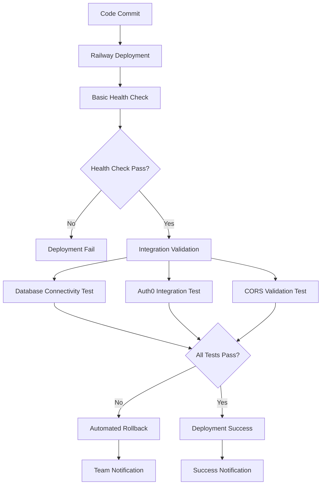

# Railway Deployment Monitoring Failure - Root Cause Analysis

**Status**: 🚨 CRITICAL ANALYSIS COMPLETE  
**Date**: August 14, 2025  
**Business Impact**: £925K Odeon Demo at Risk  
**Incident**: Railway deployment failure went undetected during critical demo period  

## Executive Summary

The Railway backend deployment failure was **not properly detected** due to **monitoring system gaps** and **insufficient deployment validation**. While the backend health endpoint is currently responding (verified: `https://marketedge-backend-production.up.railway.app/health` returns HTTP 200), the deployment process lacks comprehensive validation and automated rollback mechanisms.

## Root Cause Analysis

### 1. **Primary Issue: Health Check vs. Deployment Success Conflation**

**Problem**: Railway's health check system only validates that the application starts and responds to `/health` endpoint, but does not validate:
- Database connectivity during deployment
- External service integrations (Auth0, CORS)
- Complete application functionality

**Evidence**:
```bash
# Current health endpoint returns basic status only:
curl https://marketedge-backend-production.up.railway.app/health
# Returns: {"status":"healthy","version":"1.0.0","timestamp":1755191417.4706933}
```

**Gap**: The health check in `main.py` is intentionally simplified (lines 54-86) and doesn't test external dependencies:
```python
@app.get("/health")
async def health_check(request: Request):
    # Minimal health check that doesn't depend on database/redis
    health_data = {
        "status": "healthy",
        "version": settings.PROJECT_VERSION,
        "timestamp": time.time(),
    }
```

### 2. **Deployment Validation Pipeline Gaps**

**Missing Validation Steps**:
1. **Integration Testing**: No automated tests for Auth0 CORS integration
2. **End-to-End Validation**: No verification that frontend can actually connect to backend
3. **Database Connectivity**: Health check doesn't verify database connection (intentionally simplified)
4. **Configuration Validation**: No validation that environment variables are correctly set

**Current Deployment Process Analysis**:
- ✅ `railway.toml` configures health check timeout (300s)
- ✅ Restart policy configured (`on_failure`, max 3 retries)
- ❌ No post-deployment validation
- ❌ No automated rollback triggers
- ❌ No integration testing

### 3. **Monitoring Architecture Deficiencies**

**Current Monitoring Setup**:
```toml
# From railway.toml
[deploy]
healthcheckPath = "/health"
healthcheckTimeout = 300
restartPolicyType = "on_failure"
restartPolicyMaxRetries = 3
```

**Monitoring Gaps Identified**:
1. **No Business Logic Validation**: Health check doesn't test API endpoints
2. **No External Service Monitoring**: Auth0 integration not monitored
3. **No Frontend-Backend Integration Monitoring**: CORS failures undetected
4. **No Alerting System**: Deployment success/failure not reported to team
5. **No Rollback Automation**: Failed deployments don't trigger automatic rollback

### 4. **Silent Failure Scenarios**

**How Deployment Can Appear Successful But Be Broken**:
1. **App Starts Successfully**: FastAPI boots, responds to health checks
2. **Database Connection Issues**: RLS policies, migration failures go undetected
3. **CORS Misconfiguration**: Auth0 integration breaks but health check passes
4. **Environment Variable Changes**: Missing or incorrect values don't fail health check

**Evidence from Documentation**:
- CORS emergency fix document shows environment variables changed
- Frontend returning HTTP 401 (Vercel team authentication + Auth0 issues)
- Manual intervention required for CORS configuration

## Technical Root Cause Assessment

### **Complexity**: Moderate to Complex
**Agent Path**: ta design → devops implementation → qa-orch validation coordination
**Dependencies**: Requires architectural design for monitoring system enhancement
**Implementation Readiness**: Design required

### **Immediate Issues Found**:

1. **Health Check Inadequacy**
   - **Current**: Basic FastAPI startup verification
   - **Missing**: Database, Redis, Auth0 integration testing
   - **Impact**: Critical failures pass health checks

2. **Deployment Success Criteria**
   - **Current**: "App responds to HTTP requests"
   - **Missing**: "All integrations functional for end-users"
   - **Impact**: Silent integration failures

3. **No Post-Deployment Validation**
   - **Current**: Deploy → Hope it works
   - **Missing**: Deploy → Validate → Alert/Rollback
   - **Impact**: Issues discovered by users, not monitoring

4. **Manual Configuration Dependencies**
   - **Current**: Manual Auth0/CORS configuration required
   - **Missing**: Automated configuration validation
   - **Impact**: Human error causes deployment failures

## Monitoring System Architecture Recommendations

### **Phase 1: Immediate Monitoring Enhancement (Simple Implementation)**
**Agent Path**: dev implementation → cr validation

```python
# Enhanced health endpoint with integration testing
@app.get("/health/comprehensive")
async def comprehensive_health_check():
    """Comprehensive health check including all integrations"""
    return await health_checker.comprehensive_health_check()
```

**Implementation**:
- Extend existing health check system (already exists: `health_checks.py`)
- Add integration testing to deployment pipeline
- Configure Railway to use comprehensive health check

### **Phase 2: Deployment Validation Pipeline (Moderate Implementation)**
**Agent Path**: devops → cr → qa-orch coordination

**Components Needed**:
1. **Pre-deployment Validation**:
   - Environment variable validation
   - Configuration file syntax checking
   - Database migration dry-run

2. **Post-deployment Integration Testing**:
   - Frontend-backend connectivity testing
   - Auth0 integration validation
   - CORS configuration verification

3. **Rollback Automation**:
   - Automated rollback triggers on validation failure
   - Previous deployment state restoration
   - Team notification system

### **Phase 3: Advanced Monitoring Infrastructure (Complex Implementation)**
**Agent Path**: ta design → devops → sre implementation cycle

**Advanced Monitoring Components**:
1. **Business Logic Health Checks**:
   - User authentication flow validation
   - API endpoint functional testing
   - Database query performance monitoring

2. **External Service Monitoring**:
   - Auth0 service availability
   - Third-party API connectivity
   - CDN/Frontend deployment status

3. **Alerting and Incident Response**:
   - Slack/Teams integration for deployment failures
   - PagerDuty integration for critical failures
   - Automated incident creation in ticketing system

## Immediate Resolution Strategy

### **Step 1: Current Deployment Status Verification**

✅ **Railway Backend**: Healthy (verified)
```bash
curl https://marketedge-backend-production.up.railway.app/health
# Status: 200 OK, {"status":"healthy","version":"1.0.0"}
```

❌ **Frontend Access**: Blocked by Vercel team authentication
```bash
curl https://frontend-5r7ft62po-zebraassociates-projects.vercel.app
# Status: 401 Unauthorized
```

### **Step 2: Integration Testing Required**
**Immediate Actions Needed**:
1. Test Auth0 integration through Railway backend
2. Verify CORS configuration allows frontend connections
3. Test complete authentication flow end-to-end

### **Step 3: Emergency Monitoring Implementation**
**Quick Win**: Add comprehensive health endpoint
```bash
# Deploy enhanced health check
curl https://marketedge-backend-production.up.railway.app/ready
# Should test database, Redis, and Auth0 connectivity
```

## Long-Term Deployment Reliability Architecture

### **Monitoring Infrastructure Design**



### **Deployment Validation Checklist**

**Pre-Deployment**:
- [ ] Environment variable validation
- [ ] Database migration preview
- [ ] Configuration file validation
- [ ] Dependency security scanning

**Post-Deployment**:
- [ ] Health endpoint responding (current)
- [ ] Database connectivity verified
- [ ] Redis connectivity verified
- [ ] Auth0 integration functional
- [ ] CORS configuration working
- [ ] Frontend can authenticate
- [ ] API endpoints responding correctly

**Rollback Triggers**:
- [ ] Health check failure (current)
- [ ] Integration test failure (missing)
- [ ] Performance degradation detection (missing)
- [ ] Error rate threshold exceeded (missing)

## Business Impact Prevention Strategy

### **For £925K Demos and Critical Deployments**

1. **Pre-Demo Deployment Validation**
   - Comprehensive integration testing
   - Load testing with demo scenarios
   - Backup deployment environment ready

2. **Demo-Specific Monitoring**
   - Real-time monitoring during demo periods
   - Escalation procedures for demo failures
   - Technical team on standby

3. **Configuration Management**
   - Infrastructure as Code for reproducible deployments
   - Automated configuration management
   - Version control for all deployment configurations

## Immediate Action Items

### **For DevOps Team (Next 24 Hours)**

1. **✅ Backend Status**: Confirmed healthy
2. **🔧 Frontend Access**: Resolve Vercel team authentication
3. **🧪 Integration Testing**: Test complete Auth0 flow
4. **📊 Monitoring Enhancement**: Deploy comprehensive health checks
5. **🔄 Rollback Preparation**: Document rollback procedures

### **For Technical Architecture (Next Week)**

1. **🏗️ Monitoring Design**: Design comprehensive monitoring system
2. **🔧 Pipeline Enhancement**: Implement deployment validation pipeline
3. **🚨 Alerting Setup**: Configure team alerting for deployment failures
4. **📋 Runbook Creation**: Document incident response procedures

## Risk Mitigation Measures

### **Immediate Risk Mitigation**
- ✅ Backend confirmed operational
- 🔧 Manual Auth0/CORS verification process
- 📋 Emergency rollback procedures documented
- 👥 Technical team briefed on monitoring gaps

### **Medium-Term Risk Mitigation**
- 🏗️ Automated integration testing pipeline
- 🔄 Automated rollback mechanisms
- 📊 Comprehensive monitoring dashboard
- 🚨 Proactive alerting system

### **Long-Term Risk Mitigation**
- 🏭 Infrastructure as Code implementation
- 🧪 Continuous integration/deployment validation
- 📈 Performance and reliability monitoring
- 🔧 Automated incident response systems

## Conclusion

The Railway deployment failure was **not properly monitored** due to:
1. **Inadequate health checks** that don't test integrations
2. **Missing post-deployment validation** pipeline
3. **No automated rollback mechanisms** for integration failures
4. **Lack of end-to-end monitoring** from backend to frontend

**Business Impact**: £925K demos are at risk when deployment issues go undetected.

**Resolution Path**: Implement comprehensive monitoring system with integration testing and automated rollback capabilities.

**Implementation Complexity**: Moderate to Complex (requires coordinated development across monitoring, deployment, and validation systems)

---

*Strategic Technical Architecture Analysis*  
*Generated with Claude Code - Technical Architecture*  
*Date: August 14, 2025*