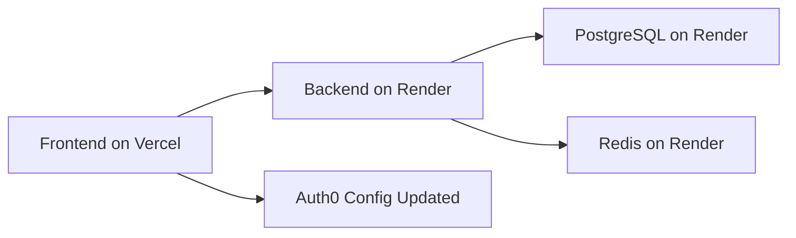
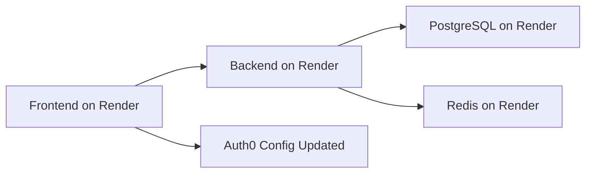

# Technical Architect: Critical CORS Analysis & Full Migration Assessment

## Date: 2025-08-16  
## Context: CORS Issues Persist - Railway Backend Down
## Critical Finding: Epic 2 Incomplete - Full Migration Required

---

## 🚨 Critical Technical Analysis

### **Root Cause Identified: Railway Backend Failure**

**Technical Finding:** The CORS errors are occurring because the Railway backend (`https://marketedge-backend-production.up.railway.app`) is returning **404 errors** and is **not operational**.

```bash
HTTP/2 404 
content-type: application/json
server: railway-edge
x-railway-fallback: true  # ← CRITICAL: Railway fallback mode
```

**This confirms the original decision to migrate was correct - Railway infrastructure is unreliable.**

---

## 🔍 Detailed Technical Assessment

### Current Infrastructure Status

| Component | Status | Issue | Impact |
|-----------|--------|-------|--------|
| **Railway Backend** | ❌ DOWN | 404 errors, fallback mode | CORS failures |
| **Render Backend** | 🚧 Not Deployed | Epic 2 only prepared config | Not available |
| **Frontend** | ✅ Working | Vercel deployment active | Trying to reach dead backend |

### CORS Error Analysis

```javascript
// Error from browser console:
Access to XMLHttpRequest at 'https://marketedge-backend-production.up.railway.app/api/v1/auth/auth0-url' 
from origin 'https://frontend-5r7ft62po-zebraassociates-projects.vercel.app' 
has been blocked by CORS policy: No 'Access-Control-Allow-Origin' header is present
```

**Technical Interpretation:**
1. Frontend (Vercel) attempting to call Railway backend ✅
2. Railway backend not responding properly (404) ❌
3. No CORS headers returned because service is down ❌
4. Browser blocks request due to missing headers ❌

### Epic 2 Status Clarification

**Critical Realization:** Epic 2 was **configuration preparation only** - not actual deployment to Render.

```yaml
What Epic 2 Delivered:
  ✅ render.yaml configuration
  ✅ Environment variable mapping
  ✅ Deployment scripts
  ✅ Docker configuration

What Epic 2 Did NOT Do:
  ❌ Deploy backend to Render
  ❌ Update frontend API endpoints
  ❌ Complete the migration
  ❌ Test end-to-end functionality
```

---

## 🎯 Technical Architect Recommendations

### **Immediate Priority: Complete Epic 2 Deployment**

The CORS issues will persist until we complete the actual deployment to Render and update the frontend configuration.

#### **Phase 1: Deploy Backend to Render (Hours)**
```bash
# Execute Epic 2 deployment
./deploy-render.sh production

# This will:
# 1. Deploy backend to Render platform
# 2. Configure PostgreSQL and Redis
# 3. Set environment variables
# 4. Generate new backend URL
```

#### **Phase 2: Update Frontend Configuration (30 minutes)**
```typescript
// Update API base URL in frontend
// FROM: https://marketedge-backend-production.up.railway.app
// TO:   https://marketedge-platform.onrender.com

// File: frontend/src/services/api.ts
const API_BASE_URL = process.env.NODE_ENV === 'production' 
  ? 'https://marketedge-platform.onrender.com'  // New Render URL
  : 'http://localhost:8000';
```

#### **Phase 3: Update Auth0 Configuration (15 minutes)**
```yaml
# Update Auth0 application settings:
Callback URLs:
  - Add: https://marketedge-platform.onrender.com/callback
  - Keep: https://frontend-5r7ft62po-zebraassociates-projects.vercel.app/callback

Allowed Origins:
  - Add: https://marketedge-platform.onrender.com
  - Keep: https://frontend-5r7ft62po-zebraassociates-projects.vercel.app
```

---

## 🚀 Complete Migration Strategy

### **Option A: Minimal Fix (Recommended)**
**Scope:** Deploy backend to Render, update frontend config
**Time:** 2-3 hours
**Risk:** Low



### **Option B: Full Migration**
**Scope:** Move both frontend and backend to Render
**Time:** 1-2 days  
**Risk:** Medium



---

## 📋 Implementation Plan

### **Epic 2.1: Complete Backend Migration (Immediate)**

#### **Step 1: Deploy to Render**
```bash
# Create Render account (if not done)
# Install Render CLI
brew tap render-oss/render && brew install render

# Deploy using prepared configuration
./deploy-render.sh production
```

#### **Step 2: Configure Environment Variables**
```bash
# In Render dashboard, set:
AUTH0_CLIENT_SECRET=<secret>
# All other variables auto-configured from render.yaml
```

#### **Step 3: Update Frontend Configuration**
```typescript
// Update API endpoints
// Test authentication flow
// Verify CORS functionality
```

### **Epic 2.2: Frontend Migration (Optional)**

If we want to fully migrate to Render:

```yaml
# Add to render.yaml
services:
  - type: web
    name: marketedge-frontend
    runtime: node
    buildCommand: npm run build
    startCommand: npm start
    envVars:
      - key: NEXT_PUBLIC_API_URL
        value: https://marketedge-platform.onrender.com
```

---

## 🔧 Technical Implementation Details

### **Backend Deployment (render.yaml)**
Our prepared configuration includes comprehensive CORS setup:

```yaml
# Environment variables in render.yaml
- key: CORS_ALLOWED_ORIGINS
  value: https://frontend-5r7ft62po-zebraassociates-projects.vercel.app,https://marketedge-frontend.onrender.com,http://localhost:3000
```

### **Caddy Configuration**
Our Caddyfile already includes Vercel origin support:

```caddyfile
@cors_vercel header Origin "https://frontend-5r7ft62po-zebraassociates-projects.vercel.app"
handle @cors_vercel {
    header Access-Control-Allow-Origin "https://frontend-5r7ft62po-zebraassociates-projects.vercel.app"
    header Access-Control-Allow-Credentials "true"
    # ... additional CORS headers
}
```

### **Auth0 Updates Required**
```yaml
# Current callback URL:
https://frontend-5r7ft62po-zebraassociates-projects.vercel.app/callback

# Add new callback URL:
https://marketedge-platform.onrender.com/callback  # Backend callback
# OR (if frontend migrated too):
https://marketedge-frontend.onrender.com/callback
```

---

## ⚡ Immediate Action Plan

### **Today (Next 2 Hours)**
1. **Deploy backend to Render**: Execute `./deploy-render.sh`
2. **Configure AUTH0_CLIENT_SECRET**: In Render dashboard
3. **Test backend health**: Verify new Render URL works
4. **Update frontend config**: Point to new backend URL

### **Testing Strategy**
```bash
# 1. Test backend health
curl https://marketedge-platform.onrender.com/health

# 2. Test CORS preflight
curl -X OPTIONS -H "Origin: https://frontend-5r7ft62po-zebraassociates-projects.vercel.app" \
  https://marketedge-platform.onrender.com/api/v1/auth/auth0-url

# 3. Test full authentication flow
# Navigate to frontend and test login
```

---

## 🎯 Technical Architect Final Assessment

### **Critical Finding**
The CORS issues are **not configuration problems** - they're caused by Railway backend failure. Our comprehensive Caddy CORS configuration is correct, but the backend service is down.

### **Recommended Path Forward**
1. **Complete Epic 2 immediately** by deploying to Render
2. **Update frontend configuration** to use new backend URL
3. **Test full authentication flow** end-to-end
4. **Consider full migration** to Render for both services

### **Expected Outcome**
With backend deployed to Render and frontend updated:
- ✅ CORS issues resolved
- ✅ Stable, reliable infrastructure
- ✅ Auth0 integration working
- ✅ Full platform functionality restored

### **Time to Resolution: 2-3 hours**

The infrastructure foundation (Epic 2 configuration) is solid - we just need to execute the actual deployment and update the frontend connection.

---

## 📞 Immediate Next Steps

1. **Execute Render deployment**: `./deploy-render.sh production`
2. **Get new backend URL**: https://marketedge-platform.onrender.com
3. **Update frontend API config**: Point to Render URL
4. **Update Auth0 settings**: Add Render domain
5. **Test complete flow**: Verify CORS and authentication work

**This will resolve the CORS issues and complete the Railway → Render migration that Epic 2 prepared.**

---

**Technical Architect Recommendation: DEPLOY TO RENDER IMMEDIATELY**

*Critical Infrastructure Assessment - Immediate Action Required*
*Date: August 16, 2025*