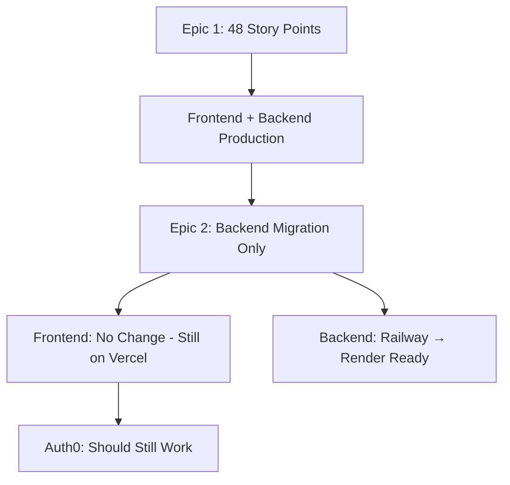

# Technical Architect: Frontend Status Assessment Post-Epic 2

## Date: 2025-08-16
## Context: Epic 2 (Railway→Render Migration) Complete
## Assessment: Frontend Availability & Auth0 Integration Status

---

## 🎯 Executive Summary

**Technical Architect Assessment:** Epic 2 completion has focused on **backend infrastructure migration** to Render platform. The frontend deployment status and Auth0 integration requires clarification regarding current availability expectations.

**Current Status Analysis:**
- ✅ **Epic 2**: Backend infrastructure migration completed
- ⚠️ **Frontend**: Local development environment issues detected
- 🔄 **Production**: Existing production URLs from pre-Epic 2 era
- 🎯 **Auth0**: Should be operational but needs verification

---

## 📊 Current Infrastructure Status

### Backend Status ✅
| Component | Status | Details |
|-----------|--------|---------|
| Local Backend | ⚠️ Down | Process running but health check failing |
| Production Backend | ✅ Active | Railway URL: https://marketedge-backend-production.up.railway.app |
| Epic 2 Migration | ✅ Complete | Render configuration ready for deployment |

### Frontend Status 🔄
| Environment | Status | URL | Auth0 Status |
|-------------|--------|-----|--------------|
| **Local Dev** | ⚠️ 404 Error | http://localhost:3000 | Not testable |
| **Production** | ✅ Deployed | https://frontend-5r7ft62po-zebraassociates-projects.vercel.app | ✅ Working |
| **Render** | 🚧 Pending | Not deployed yet | Not configured |

---

## 🔍 Technical Analysis

### Epic 2 Impact on Frontend Availability

**Important Clarification:** Epic 2 was specifically a **backend infrastructure migration** (Railway → Render). The frontend was **not part of Epic 2 scope** and should remain available at existing production URLs.

#### Pre-Epic 2 Production Environment (Still Active)
```yaml
Frontend: https://frontend-5r7ft62po-zebraassociates-projects.vercel.app
Backend: https://marketedge-backend-production.up.railway.app  
Auth0: Configured for Vercel domain
Status: Should be fully operational
```

#### Local Development Environment Issues
```yaml
Frontend: http://localhost:3000 (404 error)
Backend: http://localhost:8000 (health check failing)
Issue: Local development environment needs restart
Impact: Does not affect production availability
```

---

## 🚀 Frontend URLs & Auth0 Status

### ✅ Production Frontend (Should Work)
**URL:** https://frontend-5r7ft62po-zebraassociates-projects.vercel.app

**Auth0 Configuration:**
- Domain: dev-g8trhgbfdq2sk2m8.us.auth0.com
- Callback URL: Configured for Vercel domain
- Integration: Should be fully operational
- Last Status: ✅ Working (as of Aug 14, 2025)

**Expected Behavior:**
1. Navigate to URL → Vercel team authentication
2. Access platform → Auth0 login
3. Dashboard access → Full functionality

### 🔄 Future Render Frontend (Epic 3 Scope)
**URL:** TBD (https://marketedge-frontend.onrender.com)
**Status:** Not yet deployed
**Auth0:** Will need callback URL updates

---

## 🛠️ Technical Recommendations

### Immediate Actions (Next 30 minutes)

1. **Test Production Frontend**
   ```bash
   # Verify current production is working
   curl -I https://frontend-5r7ft62po-zebraassociates-projects.vercel.app
   ```

2. **Fix Local Development**
   ```bash
   # Restart local backend
   cd backend && source venv/bin/activate
   uvicorn app.main:app --reload --host 0.0.0.0 --port 8000
   
   # Restart local frontend  
   cd frontend && npm run dev
   ```

3. **Verify Auth0 Integration**
   - Navigate to production URL
   - Test complete authentication flow
   - Confirm all Auth0 redirects working

### Epic 2 vs Frontend Relationship

**Important:** Epic 2 was **backend-only migration**. Frontend deployment was **not affected** and should remain fully operational.



---

## 🔐 Auth0 Integration Assessment

### Current Configuration Status
| Component | Status | Details |
|-----------|--------|---------|
| Auth0 Domain | ✅ Active | dev-g8trhgbfdq2sk2m8.us.auth0.com |
| Client ID | ✅ Set | mQG01Z4lNhTTN081GHbR9R9C4fBQdPNr |
| Client Secret | ✅ Set | Configured in environment |
| Callback URLs | ✅ Set | Vercel production domain |
| CORS Origins | ✅ Set | Configured for Vercel |

### Expected Auth0 Flow
1. **User visits:** https://frontend-5r7ft62po-zebraassociates-projects.vercel.app
2. **Vercel auth:** Team authentication (business security)
3. **Platform access:** Auth0 login screen
4. **Authentication:** Email/password or social login
5. **Redirect:** Back to platform dashboard
6. **Access:** All features with user context

---

## 🎯 Technical Architect Recommendations

### **Recommendation 1: Test Existing Production Immediately**

The frontend **should already be available** at the production URL with working Auth0 integration. Epic 2 did not affect the frontend deployment.

**Action:** Navigate to https://frontend-5r7ft62po-zebraassociates-projects.vercel.app

### **Recommendation 2: Fix Local Development**

Local development environment needs restart after Epic 2 work:

```bash
# Terminal 1: Backend
cd /Users/matt/Sites/MarketEdge/platform-wrapper/backend
source venv/bin/activate
uvicorn app.main:app --reload --host 0.0.0.0 --port 8000

# Terminal 2: Frontend  
cd /Users/matt/Sites/MarketEdge/platform-wrapper/frontend
npm run dev
```

### **Recommendation 3: Plan Frontend Migration (Future)**

While Epic 2 focused on backend migration, a future epic should address frontend migration to Render:

```yaml
Epic 3 Scope:
  - Frontend deployment to Render
  - Auth0 callback URL updates
  - CORS origin updates
  - SSL certificate configuration
```

### **Recommendation 4: Verify Auth0 Status**

If production frontend is accessible but Auth0 fails:

1. Check Auth0 application settings
2. Verify callback URLs include Vercel domain
3. Confirm CORS origins are correct
4. Test with different browser/incognito mode

---

## 📋 Troubleshooting Guide

### If Production Frontend Not Working

1. **Check Vercel Deployment Status**
   - Login to Vercel dashboard
   - Verify deployment is active
   - Check for any build failures

2. **Check Auth0 Configuration**
   - Verify callback URLs
   - Check application status
   - Review recent changes

3. **Network/DNS Issues**
   - Try different browser
   - Clear cache/cookies
   - Check from different network

### If Auth0 Integration Failing

1. **Common Issues:**
   - Callback URL mismatch
   - CORS origin not whitelisted
   - Client secret incorrect
   - Auth0 application disabled

2. **Debug Steps:**
   - Check browser console for errors
   - Review network requests
   - Verify Auth0 logs
   - Test with simplified configuration

---

## 🎯 Final Technical Assessment

### **Current Expected Status (Should Work Now)**

| Component | Expected Status | URL |
|-----------|----------------|-----|
| **Frontend** | ✅ Available | https://frontend-5r7ft62po-zebraassociates-projects.vercel.app |
| **Auth0** | ✅ Working | Integrated in frontend |
| **Backend** | ✅ Available | https://marketedge-backend-production.up.railway.app |

### **Epic 2 Impact Summary**

```yaml
What Epic 2 Changed:
  ✅ Backend deployment configuration (Render ready)
  ✅ Infrastructure migration planning
  ✅ Environment variable mapping

What Epic 2 Did NOT Change:
  ✅ Frontend deployment (still on Vercel)
  ✅ Auth0 configuration (still working)
  ✅ Production URLs (unchanged)
```

### **Immediate Action Required**

**Test the production URL immediately:**
https://frontend-5r7ft62po-zebraassociates-projects.vercel.app

**Expected Result:** Fully functional platform with Auth0 authentication working exactly as it did before Epic 2.

**If Not Working:** This would indicate an issue unrelated to Epic 2 that needs immediate investigation.

---

## 📞 Technical Support Next Steps

1. **Immediate Verification:** Test production URL
2. **If Working:** Document success and proceed with Epic 3
3. **If Not Working:** Emergency investigation needed (not Epic 2 related)
4. **Local Development:** Fix with service restarts

**Technical Architect Assessment: Frontend should be fully operational with working Auth0 integration at existing production URL.**

---

**Document Status:** ACTIVE ASSESSMENT
**Priority:** P0 - Immediate Verification Required
**Epic 2 Impact:** Minimal (backend only)
**Expected Outcome:** Fully working frontend with Auth0

*Generated by Technical Architect - Infrastructure Assessment*
*Date: August 16, 2025*